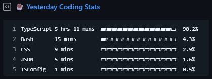
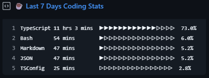
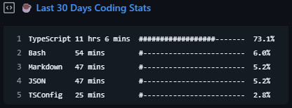

# WakaTime Stats

Display your WakaTime coding stats as a GitHub Gist on your profile.



## How to Set It Up

1. **Create a Public Gist**

    - Go to https://gist.github.com/
    - Create a new gist with any filename you want (e.g. "☕ Weekly Coding Stats")

2. **Generate GitHub Token**

    - Go to https://github.com/settings/tokens
    - Create a new **classic token** with the **"gist"** scope

3. **Get Your WakaTime Token**

    - Go to https://wakatime.com/settings/account
    - Copy your **API Key**

4. **Fork This Repository**

5. **Add Environment Variables**

    - Go to your forked repo
    - Navigate to: `Settings > Secrets and variables > Actions > New repository secret`

    Add the following three secrets:

    ```
    WAKATIME_TOKEN=your_wakatime_token
    GIST_ID=your_gist_id
    GH_TOKEN=your_github_token
    PROGRESS_STYLE=default
    ```

6. **Run the Workflow (First Time Only)**
    - Go to your forked repo
    - Open the **Actions** tab
    - Click **Update WakaTime Stats**
    - Click **Run workflow**
    - This only needs to be done once to trigger the first update

Done. The workflow will update your gist with your latest weekly coding stats.

# Progress Styles

### `default`


### `arrow`



### `hash`


